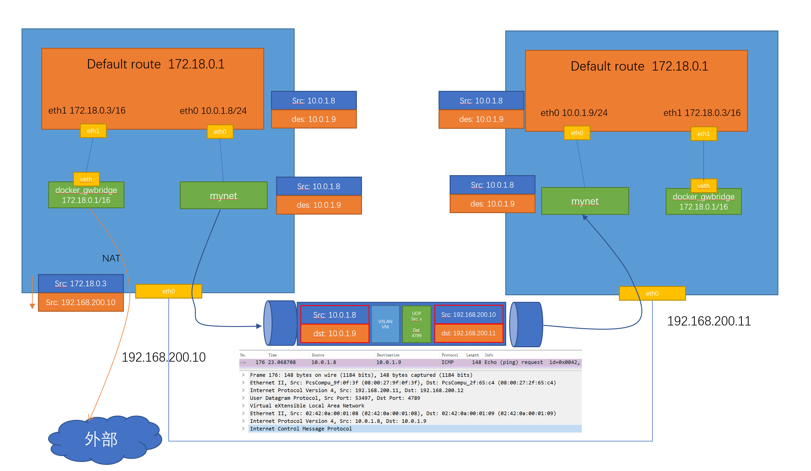

## Docker 教程

参考自

- [Docker Tips](https://dockertips.readthedocs.io/en/latest/index.html#)
- [Docker — 从入门到实践](https://yeasy.gitbook.io/docker_practice)

| 操作                            | 命令(全)                                 | 命令(简)              |
| ------------------------------- | ---------------------------------------- | --------------------- |
| 容器的创建                      | `docker container run [镜像名]`          | `docker run [镜像名]` |
| 容器的列出(up)                  | `docker container ls`                    | `docker ps`           |
| 容器的列出(up和exit)            | `docker container ls -a`                 | `docker ps -a`        |
| 容器的停止                      | `docker container stop `                 | `docker stop `        |
| 容器的删除                      | `docker container rm `                   | `docker rm `          |
| 容器的运行模式(detach,后台运行) | `docker container run -d -p 80:80 nginx` |                       |
| 查看detach模式下log             | `docker attach `                         |                       |
| 清理空闲没有使用的容器          | `docker system prune -f `                |                       |
| 清理空闲没有使用的镜像          | `docker image prune -a`                  |                       |
| 镜像的操作          | `docker image ...`                  |                       |
| volume 的操作          | `docker volume ...`                  |                       |
| network 的操作          | `docker network ...`                  |                       |
| 查看 镜像/网络/volume/容器 的详情          | `docker */*/*/* inspect`                  |                       |

### Container 快速上手

#### 运行模式

- attach 模式		例如：docker container run -p 80:80 nginx
- Detach 模式		例如：docker container run -d -p 80:80 nginx 容器会在后台运行

#### 批量停止

- 假设现在有以下三个容器`docker container ps `

```
CONTAINER ID   IMAGE     COMMAND                  CREATED          STATUS          PORTS     NAMES
cd3a825fedeb   nginx     "/docker-entrypoint.…"   7 seconds ago    Up 6 seconds    80/tcp    mystifying_leakey
269494fe89fa   nginx     "/docker-entrypoint.…"   9 seconds ago    Up 8 seconds    80/tcp    funny_gauss
34b68af9deef   nginx     "/docker-entrypoint.…"   12 seconds ago   Up 10 seconds   80/tcp    interesting_mahavira
```

- 方式一：`docker container stop cd3 269 34b`

- 方法二：`docker container stop $(docker container ps -q) `

#### 批量删除

- `docker container rm $(docker container ps -aq)`

#### 删除正在运行中的容器

`docker container rm [容器ID] -f`

`docker system prune -a -f`		可以快速对系统进行清理，删除停止的容器，不用的image(全部删除了，慎用)

#### 交互式运行容器

`docker container run -it busybox sh`		创建一个容器并进入交互式模式 

`docker container exec -it 33d sh`		在一个已经运行的容器里执行一个额外的command

#### docker container run 的背后

docker container run 的参数信息
- `-d` 以后台模式运行容器，并返回容器ID
- `-p` 指定端口映射，格式为 主机(宿主机)端口:容器端口
- `--name="xxx"` 为容器指定一个名称 
- `-it` i 已交互模式运行容器,t 为容器重新分配一个伪输入终端。一般结合使用
- `--rm` 一次性运行容器，容器运行结束后自动删除
- `-v` 指定要保存的数据卷。例如 -v cron-data:/app 。 将app目录的数据卷取个名字cron-data
- `--network` 连接到指定的网络


docker container run -d -publish 80:80 --name webhost nginx

- 1. 在本地查找是否有nginx这个image镜像，但是没有发现
- 2. 去远程的image registry查找nginx镜像（默认的registry是Docker Hub)
- 3. 下载最新版本的nginx镜像 （nginx:latest 默认)
- 4. 基于nginx镜像来创建一个新的容器，并且准备运行
- 5. docker engine分配给这个容器一个虚拟IP地址
- 6. 在宿主机上打开80端口并把容器的80端口转发到宿主机上
- 7. 启动容器，运行指定的命令（这里是一个shell脚本去启动nginx）

### 镜像的创建管理与发布

#### 镜像的获取

默认从 Docker Hub 获取镜像。如何不指定版本，默认拉取最新版本。

- `docker pull [镜像名]`		从远程 Docker Hub 获取镜像
- `docker build -t [镜像名]:[标签] [上下文路径/URL/]`		使用 Dockerfile 构建自定义镜像
  - -t 指定镜像的名称和标签
  - -f 指定要使用的 Dockerfile 的路径，默认为当前目录下
  - --no-cache 禁用构建中的缓存，强制重新构建
  - --network 指定构建过程中使用的网络模式
- `docker load < [镜像文件]`		文件导入(离线形式)

#### 镜像的基本操作
| 操作     | 命令(全)                   | 命令(简) |
| -------- | -------------------------- | -------- |
| 查看镜像 | `docker image ls`          |          |
| 删除镜像 | `docker image rm [镜像ID]` |          |

#### 镜像的导出和导入

- `docker image save [镜像名:版本号] -o [自定义镜像名称.image]`		导出镜像到本地
- `docker image load -i [导出的本地的镜像]`				导入镜像

### Dockerfile 

#### Dockerfile 指令

##### FROM [镜像]	指定基础镜像

- 尽量选择体积小的镜像

- 固定版本 tag,而不是每次都使用 latest

- scratch 为基础镜像的话，表示一个空白的镜像

##### RUN	执行命令

  - shell 格式	类似在Linux命令行中输入命令一样。支持行尾添加 \ 换行以及行首 # 进行注释
  - exec 格式	RUN ["可执行文件","参数1","参数2"] 更像函数调用中的格式

##### COPY	复制文件

- COPY 源路径 镜像内目标路径	源路径可以是多个，也可以是通配符，需要满足 Go 的 filepath.Match 规则。目标路径也可以是工作目录的相对路劲。源文件的各种元数据会全部保存(读、写、执行权限等)
- 可以加上 --chown=[user]:[group] 来改变文件所属的用户和用户组

##### ADD	更高级的复制文件

- 和 COPY 基本保持一致
- 如果复制的是一个压缩文件时，ADD会自动解压文件

##### WORKDIR	指定工作目录

- WORKDIR <工作目录路径>
- COPY ADD 会将文件放到定义的工作目录里面。进入sh后默认会是指定的工作目录

##### ARG	构建参数

- 设置环境变量。ARG 只能保存在镜像构建的时候

##### ENV	设置环境变量

- 设置环境变量。ENV 设置的变量可以在Image中保持，并保持在容器中的环境变量里

##### CMD	容器启动命令

- 有两种格式 shell 和 exec 格式。 CMD可以用来设置容器启动时默认会执行的命令。
- shell 格式会被包装为 sh -c 进行执行。变量要使用 shell 格式或者 例如：CMD echo $HOME 实际执行 CMD [ "sh", "-c", "echo $HOME" ]
- `如果docker container run启动容器时指定了其它命令，则 CMD 命令会被覆盖`
- 可以设置 CMD 为空 [],覆盖默认镜像cmd，运行容器是自定义输入 cmd 命令。例如 docker container run -it myinfo ipinfo 8.8.8.8

##### ENTRYPOINT	入口点

- CMD 可以在 docker container run 时传入其他命令，覆盖掉 CMD 命令。但是 ENTRYPOINT 所设置的命令一定会执行。
- ENTRYPOINT 也可以设置容器启动时要执行的命令，可以在docker container run 时传入其它命令
- ENTRYPOINT 和 CMD 可以联合使用，ENTRYPOINT 设置执行的命令，CMD传递参数

##### USER	指定当前用户
- 格式：USER <用户名>[:<用户组>]
- USER 指令和 WORKDIR 相似，都是`改变环境状态并影响以后的层`。注意，USER 只是切换到指定用户，这个用户必须是事先建立好的，否则无法切换。
- 如果以 root 执行的脚本，在执行期间希望改变身份，比如希望以某个已经建立好的用户来运行某个服务进程，不建议使用 su 或者 sudo，建议使用 [`gosu`](https://github.com/tianon/gosu)。

##### EXPOSE 	暴露端口
- 格式：EXPOSE <端口1> [<端口2>...]
- 声明容器运行时提供服务的端口，这只是一个声明，并不会因为这个声明应用就会开启这个端口的服务
- 运行时使用随机端口映射时 -P , 会自动随机映射 EXPOSE 的端口

##### VOLUME	定义匿名卷

- VOLUME ["<路径1>", "<路径2>"...]	将容器内的路径持久化
- VOLUME <路径>
- 容器运行时应该尽量保持容器存储层不发生写操作，对于数据库类需要保存动态数据的应用，其数据库文件应该保存于卷(volume)中。
- 当创建容器不使用 -v 参数时，自动创建匿名数据卷

##### HEALTHCHECK	健康检查

和 `CMD`, `ENTRYPOINT` 一样，如果写了多个，只有最后一个生效

- HEALTHCHECK [选项] CMD <命令>：设置检查容器健康状况的命令
  - `--interval=<间隔>`：两次健康检查的间隔，默认为 30 秒；
  - `--timeout=<时长>`：健康检查命令运行超时时间，如果超过这个时间，本次健康检查就被视为失败，默认 30 秒；
  - `--retries=<次数>`：当连续失败指定次数后，则将容器状态视为 `unhealthy`，默认 3 次。
  - `CMD` 后面的命令，`shell` 格式和 `exec` 格式。返回值决定该次健康检查的成功与否：`0`：成功；`1`：失败；`2`：保留，不要使用这个值。

- HEALTHCHECK NONE：如果基础镜像有健康检查指令，使用这行可以屏蔽掉其健康检查指令


#### Dockerfile 技巧

##### 合理使用缓存

- 容易改变的内容尽量放到后面，不容易发生改变的放到前面（例如一些 RUN、WORKDIR、ENV 等）。例如 COPY 等，文件一旦变动，这之后的命令需要重新构建不能走缓存

##### build context 优化

- 例如 [docker image build -t flask-demo .]。最后这个点就叫做 build context。是指 build 期间，我们要传输的一个目录或文件，如果这个目录下包含很多文件会导致 build context 特别大

- 配置 .dockerignore 文件，忽略一些不必要的文件。类似 gitignore 

##### 多阶段构建

- 在一个 Dockerfile 里写多个构建过程。 使用 AS 将前置镜像起一个别名，前置镜像编译后的文件， 使用 COPY --from=别名 前置镜像内文件 当前镜像文件

##### 尽量使用非 root 用户

- root 的危险性

- 使用 groupadd 和 useradd 创建非 root 用户

### Docker 的存储

默认情况下，在运行的容器中创建的文件会保存在一个可写的容器层：

- 如果容器被删除了，则数据也没有了
- 这个可写的容器层和特定的容器是绑定的，也就是说这些数据无法和别的容器共享

两种方式进行数据的持久化

- Data volume, 由 docker 管理，（/var/lib/docker/volumes/Linux）,持久化数据的最好方式
- Bind Mount, 由用户指定存储数据具体的 mount 在系统什么位置

#### Docker Volume 与 Docker Mount

- Dockerfile 内使用 VOLUME 定义持久化数据。默认会保存在/var/lib/docker/volumes/下面
- docker volume ls 查看所有的数据卷
- docker volume inspect [volumen name] 查看指定数据卷的信息 
- docker container run -v 可以给数据卷起名称，也可以用新容器指定数据卷

- docker container run -v 可以将数据卷挂载到本机目录。 例如 -v /app/:/app, 就可以在本机app目录先看到数据

#### 多个机器之间的容器共享数据

- Docker的volume支持多种driver。默认创建的volume driver都是local
- sshfs 的driver。安装 plugin vieux/sshfs

### Docker 的网络

[iptables学习]

- 容器启动时 添加 -P Docker会随机映射一个端口到内部容器开放的网络端口。-p 则可以指定要映射的端口，在一个指定端口上只可以绑定一个容器，但是可以绑定多个端口。
  - 本地的 80 端口映射到容器的 80 端口。-p 80:80
  - 映射到指定地址的指定端口。 -p 127.0.0.1:80:80
  - 映射到指定地址的任意端口。 -p 127.0.0.1::80	或者udp -p 127.0.0.1:80:80/udp
- docker network inspect [网络ID] 
- 要想容器内网络可以 ping 外部网络，需要宿主机可以 ping 外部网络
- 加入同一 网络 内的容器，可以互相ping通，并且在同一网段内。自定义的 bridge 还可以通过 容器名称 来 ping（类似DNS的功能。加入默认网络的容器不能实现）。

#### Docker Bridge 网络

- 容器默认使用 docker0 的 bridge 网络类型，创建的容器 默认接入这个网络。
- docker network create -d bridge [自定义网络名称]		创建 bridge 类型的网络
  - -d 选择网络类型。bridge、host、null
  - --geteway 自定义网关
  - --subnet 自定义网段
- docker network connect [网络名称] [容器名]		将容器链接到另一个网络
- docker network disconnect [网络名称] [容器名]		将容器的这个网络删除

#### Docker host 网络

- 容器与宿主机共享同一个网络。但是容器映射同一端口会冲突。起到一个类似本地软件的作用

#### Docker null 网络

- 禁止容器内外部通讯。没有网络环境


### Docker compose

[【docker compose 文档】](https://docs.docker.com/compose/compose-file/)

```yaml
version: "3.8"

services: # 容器 可以定义多个容器
  servicename: # 服务名字，这个名字也是内部 bridge网络可以使用的 DNS name
  	build: # 指定 Dockerfile 所在文件夹的路径
  		context: # 指定 Dockerfile 所在文件夹的路径
  		dockerfile: # 指定 Dockerfile 文件名
  	container_name: # 指定容器名称。默认将会使用 项目名称_服务名称_序号 这样的格式。(指定容器名称后，该服务将无法进行扩展（scale）)
    image: # 镜像的名字
    depends_on: # 解决容器的依赖、启动先后的问题。
    	- servicename # 启动先后顺序
    	servicename:
    		condition: service_healthy # 只有当 servicename 是健康状态时才启动
    command: # 可选，如果设置，则会覆盖默认镜像里的 CMD命令
    environment: # 可选，相当于 docker run里的 --env
    volumes: # 可选，相当于docker run里的 -v
    networks: # 可选，相当于 docker run里的 --network (可以指定多个网络)
    	[diy-network]: # 自定义网络名称
    		driver: # 配置该网络的 driver, 默认是 bridge 
    		ipam: # 自定义 ipam 配置
    			driver: # 
    			config: #
    				- subnet: # 设置网段
    					gateway: # 设置网关
    ports: # 可选，相当于 docker run里的 -p
    healthcheck: # 检查容器是否健康运行
  		test: ["CMD", "curl", "-f", "http://localhost"] # 
  		interval: 1m30s # 没多少秒去检查一次
  		timeout: 10s # 超时时间
  		retries: 3 # 重试次数
  		start_period: 40s #
  	servicename2:

volumes: # 可选，相当于 docker volume create

networks: # 可选，相当于 docker network create
```
#### docker compose 常用命令

需要在 compose 文件所在的目录运行

- up	启动命令
  - -d	后台模式运行
  - -p	修改默认的名字，但是停止 删除 查看 也需要添加 -p 才能找到
  - --build	镜像文件做出改变是，将容器自动重新进行构建
  - --remove-orphans	当修改删除 compose 文件内容时，自动删除容器（新增时 -d 自动pull去创建）
- ps	查看正在运行的
- build	构建项目中容器。指定Dockerfile所在的目录
- pull	拉取服务依赖的镜像
- restart 重启服务


Docker compose 的网络，链接相同的网络，除了可以在容器 互相 ping 对方的容器名称，也可以 ping compose 文件里的 servicename

默认情况下，default_driver 就是 bridge

Docker compose 的环境变量。可以通过创建默认的 .env 文件来生成 环境配置。在 compose 文件里通过 ${env的配置} 读取。可以通过 dokcer compose config 来查看确认。自定义配置文件使用 docker compose --env-file [自定义配置文件]   --env-file一定紧跟docker compose

#### docker compose 水平扩展

- docker compose up -d `--scale` 【service名称】=num	--scale 水平扩展指定的镜像，自动增加和删除。多个水平扩展的容器，容器内访问他们，会自动进行负载均衡

#### docker compose 服务依赖和健康检查

- 服务依赖主要通过 compose 文件里的 depends_on 配置来实现启动顺序, 当depends_on里的服务起来，对应的服务才会起来

- 通过 healthcheck 进行健康检查

https://github.com/docker/awesome-compose 里面非常多的docker-compose example
https://github.com/dockersamples/example-voting-app 投票app

### Docker Swarm

#### swarm 单节点快速上手

- 使用 docker info 查看有没有激活 docker swarm。默认没有激活（swarm：inactive）。激活单节点 dcoker swarm init
  - init 背后。主要是 PKI 和 安全 相关的自动化 1.创建swarm集群根证书 2.manager节点的证书 3.其他节点加入集群需要的tokens 。创建 Raft 数据库用于存储证书、配置和密码等数据
  - [Raft资料1](http://thesecretlivesofdata.com/raft/) [Raft docker_hub](https://docs.docker.com/engine/swarm/raft/)
  - 如果你的 Docker 主机有多个网卡，拥有多个 IP，必须使用 `--advertise-addr` 指定 IP。
- docker node ls	查看当前所有节点
- docker swarm leave	离开集群
- docker service create [镜像]	创建服务
  - --network	指定需要使用的网络（一般类型为 overlay 的网络）
  - --replicas	
  - --name
  - -p	端口映射
  - --secret	指定要使用的secret(secret文件保存在容器内 /run/secrets/ 下)
  
- docker service ls	查看当前集群运行的服务
- docker service rm	删除服务
- docker service ps [服务ID] 查看某个服务的详情
- docker service update [服务ID] --replicas 3	设置该服务下扩展3个容器数量。（容器退出会自动启动容器，保证正常3个容器启动）


#### swarm 多节点

- 命令只能在 manager 节点上运行
- docker swarm join --token		增加工作节点
- docker service scale nginx=5		服务伸缩，扩展nginx容器为5个，也可以减少
- docker service logs		查看某个服务的日志。可以显示多个节点的日志

#### swarm 的 overlay 网络



- 使用 swarm 时，会出现 overlay 类型的网络。manager 创建网络会同步到所有节点上。
- 容器会链接两个网络，一个 overlay 网络，一个 bridge 网络（容器在当前机器对外通信时的网络）。两个不同节点上容器间通信 需要通过 overlay 网络进行通信
- 第一是外部如何访问部署运行在swarm集群内的服务，可以称之为 `入方向` 流量，在swarm里我们通过 `ingress` 来解决
- 第二是部署在swarm集群里的服务，如何对外进行访问，这部分又分为两块:
  - 第一，`东西向流量` ，也就是不同swarm节点上的容器之间如何通信，swarm通过 `overlay` 网络来解决；
  - 第二，`南北向流量` ，也就是swarm集群里的容器如何对外访问，比如互联网，这个是 `Linux bridge + iptables NAT` 来解决的
- Tcpdump 抓包


- Ingress 网络
- docker swarm的ingress网络又叫 `Ingress Routing Mesh` 主要是为了实现把service的服务端口对外发布出去，让其能够被外部网络访问到。
  - iptables的 Destination NAT流量转发
  - Linux bridge, network namespace
  - 使用IPVS技术做负载均衡
  - 包括容器间的通信（overlay）和入方向流量的端口转发
- 

#### swarm 的部署
部署服务使用 docker stack deploy，其中 -c 参数指定 compose 文件名。

- docker stack ls	查看服务
- docker stack down	移除服务


- docker secret create [名称]	
  - 例如：openssl rand -base64 20 | docker secret create mysql_password -	以管道符的形式创建 secret
  - 例如：docker secret create mysql_pass.txt	以文件形式创建
- docker secret ls	查看秘钥
- docker secret inspect [秘钥名]	秘钥的详细