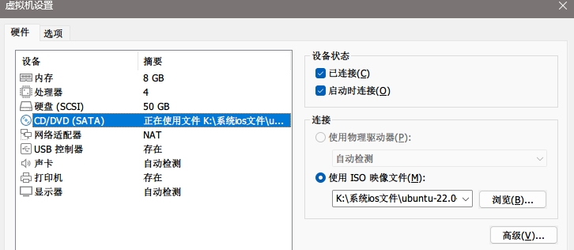
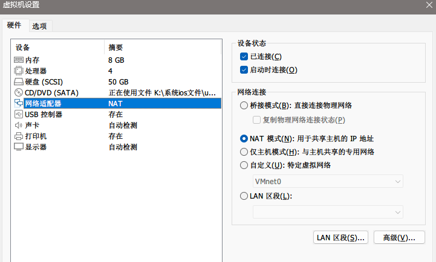

## 虚拟机Linux环境安装

### Centos 安装

### Ubuntu 安装

#### 一、 下载 ubuntu 镜像

1. 从[清华大学 TUNA 协会](https://tuna.moe/)的开源镜像站下载各种镜像。这里选择 [22.04.4 (amd64, Server)](https://mirrors.tuna.tsinghua.edu.cn/ubuntu-releases/jammy/ubuntu-22.04.4-live-server-amd64.iso)。
2. 或者 [阿里巴巴开源镜像站](https://developer.aliyun.com/mirror/)选择 OS镜像 进行下载。

#### 二、 安装镜像

##### 1. 打开 vmware 新建虚拟机。选择稍后安装操作系统，选择客户机系统为 ubuntu。其余一路默认即可。

##### 2. 选择创建的虚拟机，右键设置。自定义分配资源。
   
   

##### 3. 开启虚拟机。安装 ubuntu 22.04 
   提示有新版本（这里是 22.05.1 版本）可用，询问是否更新到新版本（Update to the new installer），或者不更新并继续安装当前版本（Continue without updating），这里我们选默认的“Continue without updating”，回车确认：
   
   网络配置，默认 DHCP 自动获取 IP 地址，如下图所示：
   
   假设我们希望配置为静态 IP，这样保证系统在重启后网络 IP 不会发生变化，方便我们利用 Xshell 等工具进行 SSH 连接和测试。
   如此，键盘上下键选中“[ens32 eth - ▶ ]”，按空格键或回车弹出修改“Edit IPv4”选项，再次回车确认：
   
   IPv4 Method 选择 Manual 手动，回车：
   
   填写 Subnet（子网 CIDR）、Address（本机私有 IP 地址）、Gateway（网关 IP）、Name servers（命名服务器，也就是 DNS，多个用英文逗号分隔）、Search domains（搜索域），最后选中“Save”回车确认保存：
   
   PS：
   1）如果你使用到了 IPv6，也是类似地配置，这里保持 Disabled，即不启用 IPv6；
   2）具体的配置值如何填写可参考后面的章节（5、配置静态 IP）；
   3）也可以这里先保持默认的 DHCP 自动获取 IP 地址方式，在系统安装完成之后，再按照后面的章节（5、配置静态 IP）演示的操作步骤进行重新配置。

确认修改完成后，选中“Done”并回车确认：
   
   配置 Ubuntu 系统镜像源地址，默认为 http://cn.archive.ubuntu.com/ubuntu：
   
   可替换为国内的开源镜像源地址:
1）阿里云源，配置 Mirror address 为：https://mirrors.aliyun.com/ubuntu
2）腾讯云源，配置 Mirror address 为：https://mirrors.cloud.tencent.com/ubuntu
3）华为云源，配置 Mirror address 为：https://repo.huaweicloud.com/ubuntu
4）清华大学源，配置 Mirror address 为：https://mirrors.tuna.tsinghua.edu.cn/ubuntu
5）中科大源，配置 Mirror address 为：https://mirrors.ustc.edu.cn/ubuntu

PS：也可以这里先保持默认的源，在系统安装完成之后，根据需要再决定，可按照后面的章节（8、替换默认源）演示的操作步骤进行重新配置。

这里以阿里云源为例，配置完成后，选中“Done”并回车确认：
   
   配置用户名、登录密码等，根据个人情况填写，然后选中“Done”并回车确认：
   
   勾选“Install OpenSSH server”安装 OpenSSH 服务包，以启用对服务器的安全远程访问，然后选中“Done”并回车确认：
   
   安装完成后，选中“Reboot Now”并回车以重启系统：
   
   如果出现“[FAILED] Failed unmounting /cdrom”错误，且提示“Please remove the installation medium, then press ENTER: Unmounting /cdrom”，则按下 ENTER 回车键让它继续重启（此时 CD/DVD (SATA) 设备应该已经自动断开连接了）：
   
##### 4. 设置静态IP

```yaml
network:
  version: 2            # 不用动
  renderer: networkd    # 不用动
  ethernets:
    ens33:              # 此处是网卡名称，配置文件里默认就有
      dhcp4: false      # 禁用动态IPv4
      dhcp6: false      # 禁用动态IPv6


      addresses: [192.168.118.212/24]   # 配置静态IP地址，及IPv4子网前缀长度
      # 子网掩码一般是255.255.255.0，实际是一串32位长度的2进制数，24表示前24位固定

      addresses: 
        - 192.168.118.212/24        # 也可以这么配置静态IP


      routes:
        - to: default               # 表示默认路由，将所有流量通过指定的网关发送，不用动
          via: 192.168.118.254      # 网关  如果没有特殊配置，那就填路由器的管理地址ip
                                    # 注意：via的v 要严格和 to的t 对齐！！

      nameservers:                  # 这一部分是配置DNS
        addresses: [192.168.43.5,192.168.43.6]  # 多个DNS之间使用逗号分隔
                                    # 如果没有特殊配置，就用 [114.114.114.114,8.8.8.8]
      nameservers:
        addresses:
          - 192.168.43.5            # 也可以这么配置DNS
          - 192.168.43.6
```

修改后执行命令`sudo netplan apply`，以立即应用更改。

如果执行apply命令出现以下警告：

```
# 配置文件权限警告 ** (generate:1170): WARNING **: 10:48:44.225: Permissions for /etc/netplan/00-installer-config.yaml are too open. Netplan configuration should NOT be accessible by others. 
# 服务缺失警告 WARNING:root:Cannot call Open vSwitch: ovsdb-server.service is not running.
```

执行命令`sudo chmod 600 /etc/netplan/00-installer-config.yaml`修改配置文件权限（权限必须为600），ovsdb-server.service服务不是必须的，这里不安装它。